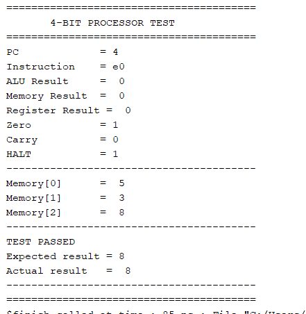
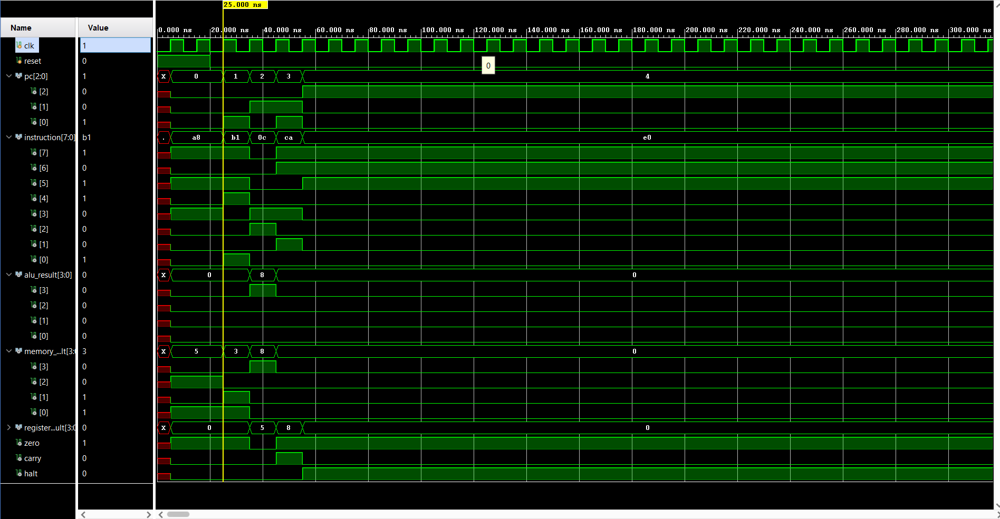
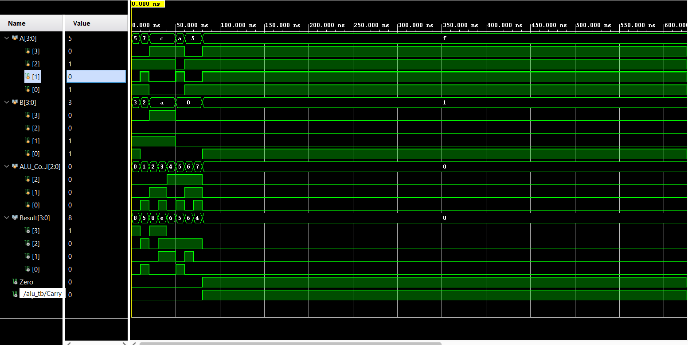
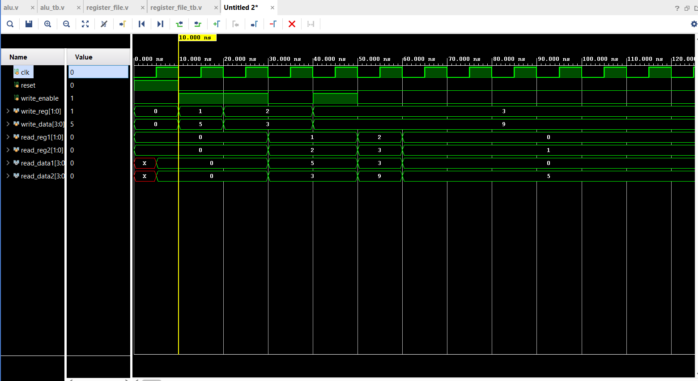
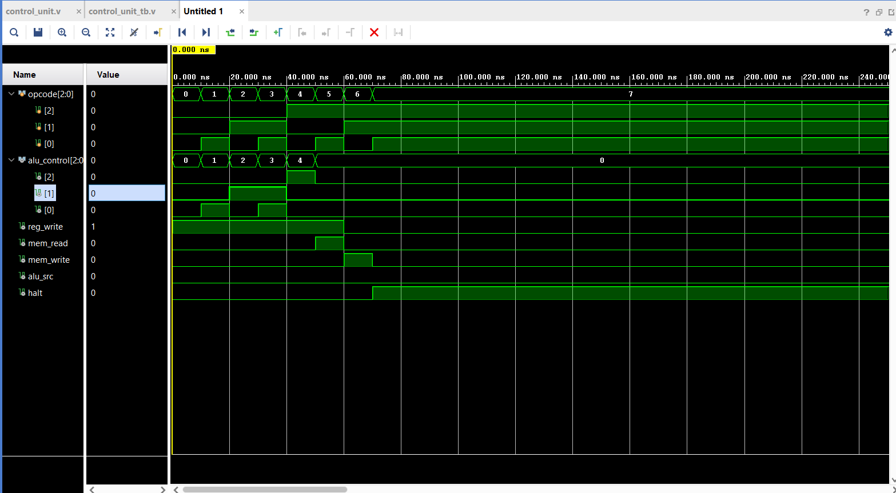
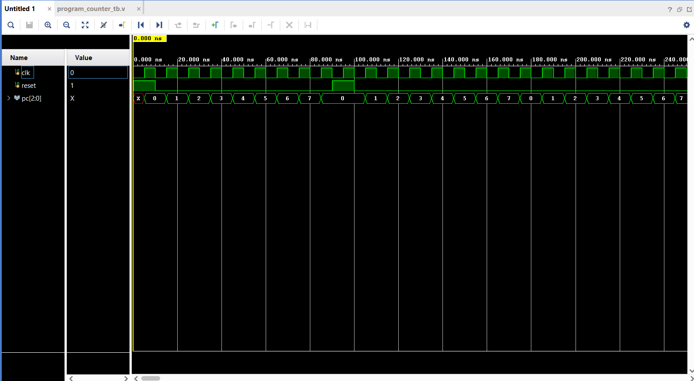
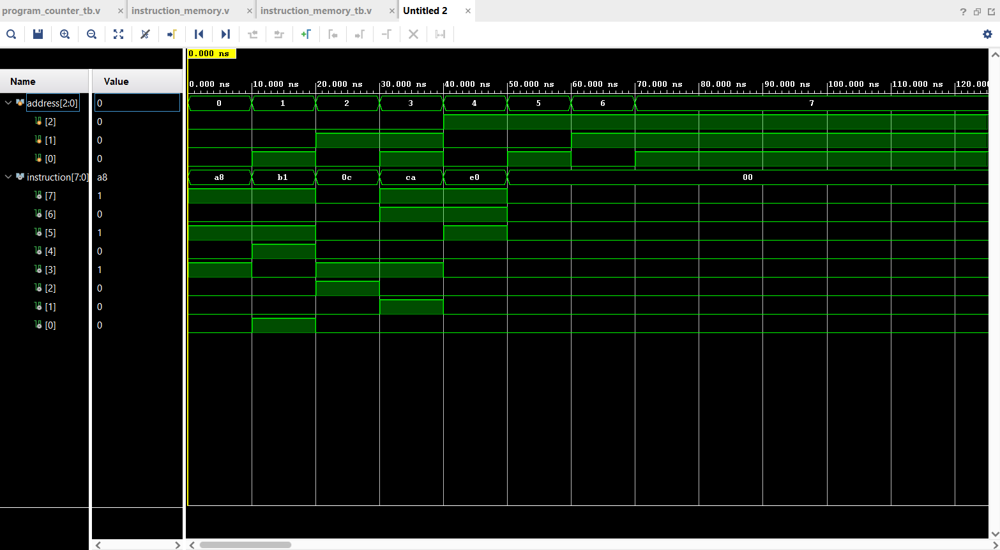
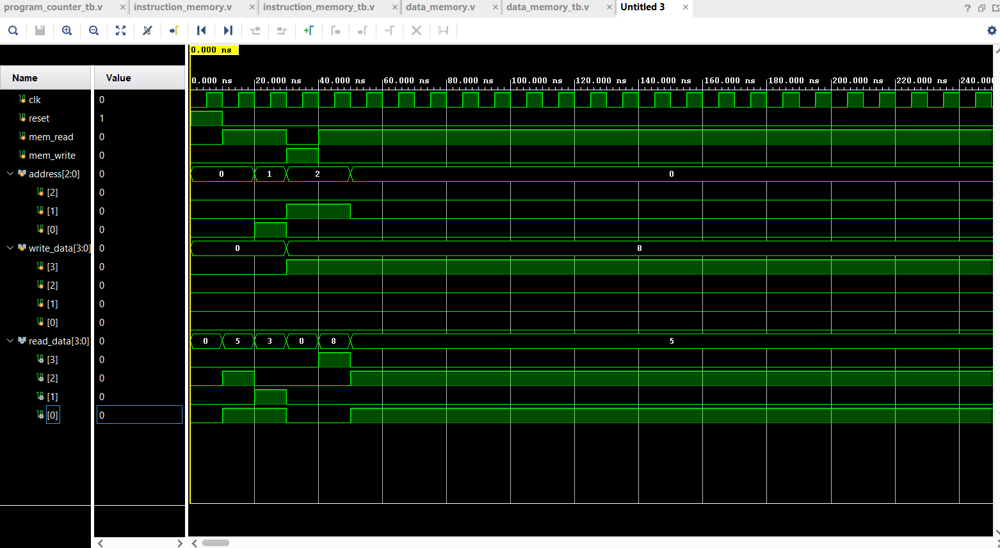

# 4-Bit Processor – Verilog HDL

A simple 4-bit processor designed and simulated using Verilog HDL and Xilinx Vivado.

---

## 📁 Repository Structure

```text
4-bit-Processor/
│
├── README.md
├── .gitignore
│
├── src/
│   ├── alu.v
│   ├── register_file.v
│   ├── control_unit.v
│   ├── program_counter.v
│   ├── instruction_memory.v
│   ├── data_memory.v
│   └── processor.v
│
├── testbenches/
│   ├── alu_tb.v
│   ├── register_file_tb.v
│   ├── control_unit_tb.v
│   ├── program_counter_tb.v
│   ├── instruction_memory_tb.v
│   ├── data_memory_tb.v
│   └── processor_tb.v
│
└── waveforms/
    ├── alu_waveform.png
    ├── register_file_waveform.png
    ├── control_unit_waveform.png
    ├── program_counter_waveform.png
    ├── instruction_memory_waveform.png
    ├── data_memory_waveform.png
    ├── processor_waveform.png
    └── test_result.png
```

---

## Features

- **4-bit ALU** (Arithmetic & Logical operations)
- **4 × 4-bit Register File**
- **Program Counter** (PC)
- **Instruction Memory** (ROM)
- **Data Memory** (RAM)
- **Control Unit** (Instruction decoding & execution sequencing)
- **Load and Store operations**
- **HALT instruction**
- **Comprehensive simulation and waveform verification**

---

## Processor Architecture

The processor follows a single-cycle execution flow:

```text
Program Counter → Instruction Memory → Control Unit → Register File → ALU → Data Memory → Write Back
```

---

## ALU Operations

| ALU Control | Operation |
|---|---|
| 000 | ADD |
| 001 | SUB |
| 010 | AND |
| 011 | OR |
| 100 | XOR |
| 101 | NOT |
| 110 | Increment |
| 111 | Decrement |

---

## Instruction Set

| Opcode | Instruction | Description |
| :---: | :---: | :--- |
| `000` | **ADD** | Add register values |
| `001` | **SUB** | Subtract register values |
| `010` | **AND** | Logical AND operation |
| `011` | **OR** | Logical OR operation |
| `100` | **XOR** | Logical XOR operation |
| `101` | **LOAD** | Load data from Memory to Register |
| `110` | **STORE** | Store data from Register to Memory |
| `111` | **HALT** | Terminate execution |

---

## Verification

The processor was verified using a Verilog testbench (`processor_tb.v`).

**Test program:**
1. `Memory[0] = 5`
2. `Memory[1] = 3`
3. `ADD` operation produces `8`
4. Result is stored in `Memory[2]`
5. `HALT` instruction stops execution

### Final Result

- `Memory[0] = 5`  
- `Memory[1] = 3`  
- `Memory[2] = 8`  

**TEST PASSED**



---

## 📊 Simulation Waveforms

All simulation waveform screenshots are saved in the [`waveforms/`](./waveforms/) directory:

| Module | Waveform Preview | Description |
| :--- | :--- | :--- |
| **Integrated Processor** | `waveforms/processor_waveform.png` | Complete end-to-end execution of the 4-bit processor |
| **Arithmetic Logic Unit (ALU)** | `waveforms/alu_waveform.png` | Verifies arithmetic and logical operations |
| **Register File** | `waveforms/register_file_waveform.png` | Verifies register read/write timing |
| **Control Unit** | `waveforms/control_unit_waveform.png` | Verifies opcode decoding and control signal generation |
| **Program Counter** | `waveforms/program_counter_waveform.png` | Verifies PC increment, enable, and reset behavior |
| **Instruction Memory** | `waveforms/instruction_memory_waveform.png` | Verifies instruction fetch addressing |
| **Data Memory** | `waveforms/data_memory_waveform.png` | Verifies memory load/store operations |

### Waveform Visualizations

#### 1. Integrated Processor


#### 2. Arithmetic Logic Unit (ALU)


#### 3. Register File


#### 4. Control Unit


#### 5. Program Counter


#### 6. Instruction Memory


#### 7. Data Memory


---

## 🛠️ Tools

- **Hardware Description Language:** Verilog HDL
- **IDE & Synthesis Tool:** Xilinx Vivado
- **Simulator:** Vivado Simulator (XSim)
- **Version Control:** Git / GitHub

---

## 🚀 How to Run Simulation

1. Open **Xilinx Vivado**.
2. Create or open the project and add all source files from [`src/`](./src/) and testbenches from [`testbenches/`](./testbenches/).
3. In the Flow Navigator, click **Run Simulation** $\rightarrow$ **Run Behavioral Simulation**.
4. To export waveforms, go to **File** $\rightarrow$ **Export** $\rightarrow$ **Export Simulation Waveform Image...** or capture via Windows Snipping Tool (`Win + Shift + S`).
